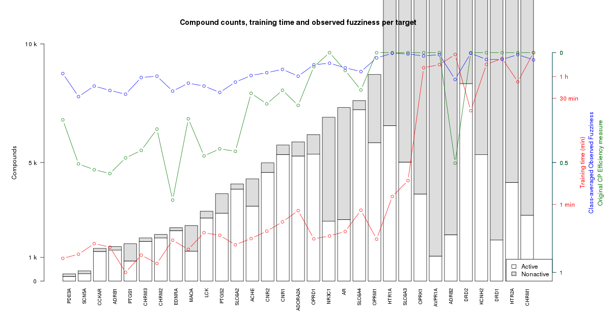

# PTP Meeting 6 Nov 2017

Participants: Jonathan, Staffan, Ola, Samuel

## Recap

We looked at this plot, based on the latest UPPMAX run:

## Action points

- [x] Ola to ask for more CPU hours
- Samuel to:
  - [ ] Start writing
  - [ ] Rerun the current run with 2 more replicates, to get some
    variance of the efficiency measures
  - [ ] Implement drawing random "assumed negative" examples, up to
    double the size of the number of active compounds for each model.
    (Only for the non-huge datasets).
  - [ ] Fix plot:
    - [ ] Split plot into "small" and "huge" parts
    - [ ] Adjust so plotted circles align in middle of the stacks
    - [ ] Use same color for blue and green lines, but with some other variation,
      like line type and "ball" type
