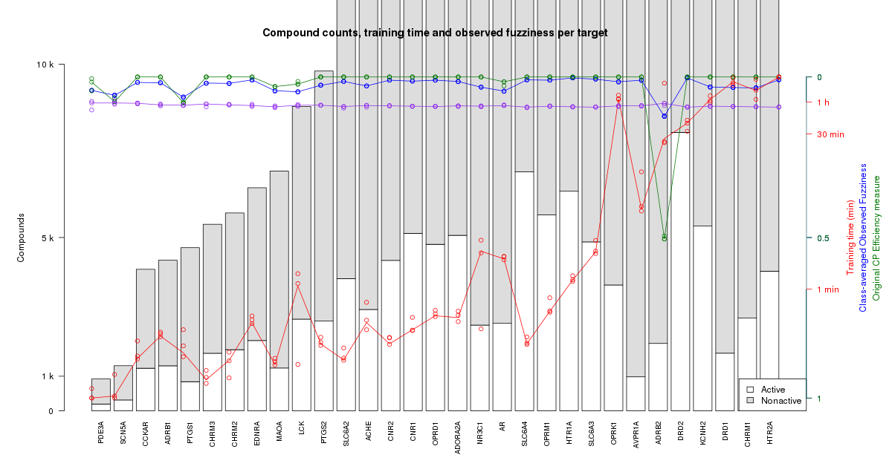

# PTP meeting 2018-02-23

Present: Ola, Jonathan, Staffan, Samuel

## Today's plot

We looked at this figure, which was created after we implemented "fillup of
assumed negatives" for datasets with smaller than 100 actives.

- Jonathan noted that the idea was to "fill up to 2x the number of actives",
  not "fillup up with 2x the number of actives", which means we now have
  sometimes more than 2x the number of nonactives than actives, for the small
  datasets.
  - Ola didn't think it had a large impact.

## Next steps
- [ ] Samuel to compare approved / withdrawn drugs with actives / nonactives in
  ExcapeDB, to get an overview of how they relate.
- [ ] From the last meeting we had the idea to also compare with
  actives/nonactives in DrugBank.
- [ ] Samuel will then look at predicting / generating binding profiles on
  UPPMAX, by running cpSign in commandline mode.
  - Staffan noted that cpSign has some upstart time to take into account, but
    should not be too much of a problem if all compounds are kept together (as
    SMILES) in the same input file and sent to cpSign. Then it is only for each
    target that this has to be run separately, which is not too much of a
    problem.
- [ ] In parallel, Jonathan will look at enabling to upload jar-models from
  cpSign in ModellingWeb (how to spell that?), so that we can eventually
  predict / generate target binding profiles via the API.

## Discussion about building models based on binding profiles

After the todos above are done, we want to use the generated binding profiles
to see if they can be used to - in turn - train e.g. an SVM model to predict
approval / withdrawal.

So, to recapitulate, we have now built models which predict binding to specific
targets. The idea is to then predict target building profiles for a large set
of compounds with some known property (like benig approved/withdrawed from the
market) to train a predictive model for that property, based on the binding
profile.

We were discussing whether the fact that approved/withdrawed molecules are
already included in the initial model training (for the models used to generate
the binding profiles), meaning that to do proper validation of this prediction,
we would probably need to take out a test set already from this stage, not only
for the second SVM training done on the binding profiles. Ola suggested to take
out a set of 250/250 actives/nonactives for this. Then, for the final
"target binding profile" based model, we would do another training, where
all the data is included.
