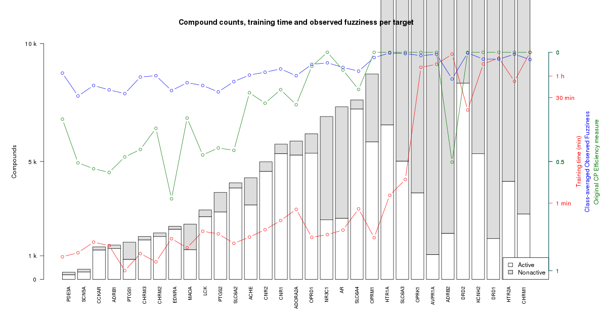
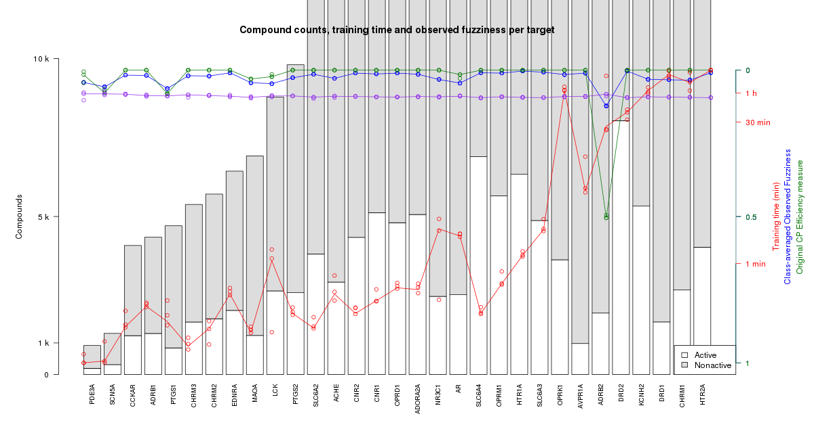

# Project meeting 2017-09-29

Participants: Jonathan, Staffan, Samuel (and Ola, for 20 minutes at the end).

Since CVAP (Cross Venn-Abers Prediction) is not yet done, we will go with ACP
(Aggregated Conformal Prediction) instead.

(ACP being to randomly drawing a subset of the dataset for calibration(?) ...
and doing this multiple times and aggregating the multiple models into "one"
...  and doing this multiple times and aggregating the multiple models into
"one" ... if Samuel understood this correctly)

## A rough overview of the workflow to implement

### Get the ExcapeDB data

Done already. It is an 18Gb .tsv file.

Samuel did count the number of ligands bound to the 44 hazard-indicating target
proteins in [Bowes et al](http://www.nature.com/nrd/journal/v11/n12/abs/nrd3845.html), table 1.

They span from 40 ligands on the smallest one (KCNQ1), to 8617 on the largest
one (DRD2).

### Create one dataset per target

Create one dataset (in "tsv / smiles format") per target, out of those 44 in
the Bowes paper mentioned above.

CPSign takes a "smiles format" as input, which is basically a tsv type of
format with the following properties:

- SMILES should be in the first column
- Easiest if the value to be trained on is in second column (We will go with
  the "Activity flag" from the ExcapeDB data here, either using the existing
  "N" and "A" ids, or possibly changing to 0 and 1 ... but not -1, as that will
  create problems).
- We were discussing if we should put the gene name as the third column, but
  since we will put this in the file name anyways, we thought this is quite
  some waste of disk space.

### Parameter optimization

We will do parameter optimization on Gamma and Cost only, and perhaps
only with like three values for each. Something like (Check Jonathan's thesis
paper for details):

- Cost: 1, 10, 100
- Gamma: 0.1, 0.01, 0.001

Inside each such parameter combination, run CPSign Cross-Validate.

As a result from the parameter optimization, we get values for Efficiency and
Validity for each of the predictions, and can select the best parameter combo.

### Actual training

The actual training will be done in two steps:

- CpSign Pre-compute, which will create a sparse representation of the dataset.
- The actual computing step.
  - This could potentially be parallelised with SciPipe, since it will run some
    number (like ten) of trainings, using ACP, and then aggregate them together
    into one "aggregate" model at the end.

### Publishing of models in OpenShift (messi)

We were also discussing about how to publish the models in the end.

We think it is best to publish them as separate microservices per protein
target, so 44 separate ones.

We need to create some docker image and templates for these. We will want to
script the creation of them also, since 44 is a bit too much to create manually
by hand.

This task might go to Jonathan.

## Misc notes and links

- Samuel will re-read the [Norlinder introductory paper on CP](http://dx.doi.org/10.1021/ci5001168)

- Submission deadline in the [cheminformatics collection in frontiers](https://www.frontiersin.org/research-topics/5898/chemoinformatics-approaches-to-structure--and-ligand-based-drug-design)
is November 10
- The Journal is [Frontiers in Pharmacology](https://www.frontiersin.org/journals/pharmacology)

Some notes about calibration plot [by Staffan](https://pharmbio.slack.com/archives/C79QQNHU5/p1506582144000104),
in the chat, at 9:02, Sep 29 2017:

> @saml @jonalv ska vi ha ett möte på måndag då? för att svara på några
> frågor: Jag har presenterat mitt papper på COPA (var i sthlm i juni) som
> gjordes tillsammans med Lars och Paolo (samt ola såklart). Det finns en
> python-kod för att göra CVAP, men till pappret i november så ska jag
> implementera detta i CPSign så att det går snabbare etc. Kalibration-plot är
> ett koncept inom området bygga modeller, där kalibrerings-setet används för
> att "kalibrera" det värde/intervall som din prediktion får *efter* att
> bakomliggande maskininlärning gett ett värde för det nya exemplet. Dvs när
> ett nytt exempel predikteras så får man en `score` som är i intervallet [0, 1],
> men den faktiska prediktionen beror på kalibreringssetet och den isotoniska
> regressionen. Om ni tänker tillbaka till någon presentation som jag gjorde
> tidigare när vi var på krusenberg så visade jag två plottar över `p0` och
> `p1` som då används för att bestämma intervallet för den nya prediktionen.
> Kalibreringsplotten ska då visa hur långt `p0` och `p1` ligger ifrån varandra
> vid en given `score` som din bakomliggande ML ger dig. Bredden på intervallet
> säger något om "hur säker" prediktionen är. efficiency-plot antar jag att det
> är bredden på prediktionsintervallet som menas

## Misc links

- [CPSign Documentation](http://cpsign-docs.genettasoft.com/)

# Project meeting 2017-10-18

- Time: 11:15-12:00 ca
- Participants: Jonathan, Staffan, Ola, Samuel (via Hangout)

## Various notes and todos

- Samuel to start writing down the methods section of the paper (in the
  repo), and explaining in words what the workflow does, so as to allow review
  of these parts by others in the project.
- Samuel also to create summaries over the 44 targets/models ... stuff like:
  - Number of active ligands
  - Number of non-active ligands
  - Time to model with liblinear
  - Efficiency
  - Cost
  - Validity (Suggested by Ola ... we had a little discussion whether needed or
    not, but)
  - Efficiency/Validity of the final model too, not just the crossvalidated one?
- Ola to send list of Conformal Prediction papers to @samuell

## Questions and Answers

- How to do the efficiency averaging for selecting best cost/gamma?
  - Individually per target, or as an average value across all targets?
    - Answered before already: Per target

- Do we need to do any type of filtering of the data ... such as only selecting
  compounds with IC50/EC50 or ... values? ... or those with value over
  10microMolar? (Like in the TargetNet paper)
  - Answer: Should be already filtered in ExcapeDB

- Do we need to take any measures to guarantee that we have balance between
  positive and negative examples in our data?
  - No, we do mondrian CP already to account for that.
  - Might be good to plot the data set characteristics though.

- How many to run with libSVM?
  - Answer: We try to run everything with liblinear first, and then see how the efficiency etc looks.
  - Possibly put a breakpoint at 5k or 10k ligands.

- How many more genes?
  - Do the 44 (in the Bowes et al paper) and evaluate how much time it takes,
    etc, etc.
  - If we want, we could later take e.g. all targets that have data about more
    than 100 ligands, etc (which should be somewhere around 600).

# Project meeting 2017-10-27

- Participants: Jonathan, Staffan (before lunch), Ola, Samuel

## Action points

- [ ] Read up on Norinder's paper on imbalanced datasetes in conformal
  prediction (Jonathan, and Samuel)
- [ ] Look closer at the "other" efficiency measure, available in:
  - Vovk, V., Fedorova, V., Nouretdinov, I., Gammerman, A., 2016. Criteria of
    efficiency for conformal prediction. In: Symposium on Conformal and
    Probabilistic Prediction with Applications. Springer, pp. 23–39.
- [x] Samuel to start writing the methods section in manuscript.
- [ ] Next meeting: Probably on Monday, Oct 30

## Main conclusions

The main conclusion from the meeting was that it seems we might want to do a
PTP 1 and a PTP 2 project, like follows:

### PTP 1

- Journal aim: [Frontiers](https://www.frontiersin.org/research-topics/5898/chemoinformatics-approaches-to-structure--and-ligand-based-drug-design) (Deadline Nov 10)
- Exclude targets with fewer than 100 active or non-active
- Probably use the "new" efficiency measure, which is possible to use
  separately per class (active/nonactive)
- Preferrably do stratified cross-validation
- Perhaps fill up with presumed non-active compounds

... and PTP 2 like follows:

### PTP 2

- Journal aim: Unclear, but later
- Test whether compounds set as inactive in older ChEMBL versions show up as
  active ones in newer versions.
- Try to predict false nonactive ones, and remove from training?
- Try various strategies at managing small datasets:
  - Validate with leave-one-out instead of cross validation
  - Run libSVM instead of LIBLINEAR?
  - Run Venn-Abers to get ROC-curves?

## Other notes

- The `--proper-train` flag is used for the dataset that should not be included
  in calibration nor testing.
- The `--train` flags is for data that is used for both
  - Remaining question: So, it is used in neither calibration nor testing?

# Project meeting 2017-10-30

Participants: Ola, Jonathan, Staffan, Arvid, Samuel

## Action points

- [ ] Ola to send conformal prediction-reading list to Samuel (reminder)
- [x] Staffan to implement the new measure ("Observed Fuzziness". See [Eq 9](https://link.springer.com/chapter/10.1007/978-3-319-33395-3_2#Equ9)
  in [Vovk et al 2016](https://doi.org/10.1007/978-3-319-33395-3_2)).

## Questions and Answers

- Do stratified classification?
  - We delay this and see how good it gets with the other modifications first.
  - Ola thinks it is not clarified completely how much it helps.
- Do we fill upp with non-active compounds?
  - We delay this also, and see how good it gets with the other modifications first.
  - `--proper-train` flag in cpsign has thus lower prio too.

# Project meeting 2017-11-06

Participants: Jonathan, Staffan, Ola, Samuel

## Recap

We looked at this plot, based on the latest UPPMAX run:



## Action points

- [x] Ola ask the Frontiers journal for a 2 month deadline extension
- [x] Ola to ask for more CPU hours
- Samuel to:
  - [x] Start writing
  - [x] Rerun the current run with 2 more replicates, to get some
    variance of the efficiency measures
  - [x] Implement drawing random "assumed negative" examples, up to
    double the size of the number of active compounds for each model.
    (Only for the non-huge datasets).
  - [ ] Fix plot:
    - [ ] Split plot into "small" and "huge" parts
    - [ ] Adjust so plotted circles align in middle of the stacks
    - [ ] Use same color for blue and green lines, but with some other variation,
      like line type and "ball" type

# Project meeting 2017-12-04

Participating: Ola, Jonathan, Staffan, Samuel

- Samuel: Tried running with replicates now, and with the new efficiency measure.
  - [x] Ola: Let's plot the new observed fuzziness score both with and without
    the class-averaging (Samuel).
- Samuel: We found some inconsistencies in the data.
  - [ ] Needs more investigation as to whether it is like this in the original
    ExcapeDB data, or has shown up in our own workflow (Samuel).
- How to filter contradictory and possibly duplicate data?
  - Ola: Probably remove
  - Jonalv: For contradictory data, we might want to do majority voting

# Project meeting 2017-12-21

- [ ] After implementing the ~30 targets, try running the models on known actives / inactives in drugbank, to get target profiles for them ... and do some comparisons.

# Project meeting 2018-02-23

Present: Ola, Jonathan, Staffan, Samuel

## Today's plot

We looked at this figure, which was created after we implemented "fillup of
assumed negatives" for datasets with smaller than 100 actives.



- Jonathan noted that the idea was to "fill up to 2x the number of actives",
  not "fillup up with 2x the number of actives", which means we now have
  sometimes more than 2x the number of nonactives than actives, for the small
  datasets.
  - Ola didn't think it had a large impact.

## Next steps
- [ ] Samuel to compare approved / withdrawn drugs with actives / nonactives in
  ExcapeDB, to get an overview of how they relate.
- [ ] From the last meeting we had the idea to also compare with
  actives/nonactives (edit: approved/withdrawn) in DrugBank. (Ola says this is
  the same)
- [ ] Samuel will then look at predicting / generating binding profiles on
  UPPMAX, by running cpSign in commandline mode.
  - Staffan noted that cpSign has some upstart time to take into account, but
    should not be too much of a problem if all compounds are kept together (as
    SMILES) in the same input file and sent to cpSign. Then it is only for each
    target that this has to be run separately, which is not too much of a
    problem.
- [x] In parallel, Jonathan will look at enabling to upload jar-models from
  cpSign in ModellingWeb (how to spell that?), so that we can eventually
  predict / generate target binding profiles via the API.

## Discussion about building models based on binding profiles

After the todos above are done, we want to use the generated binding profiles
to see if they can be used to - in turn - train e.g. an SVM model to predict
approval / withdrawal.

So, to recapitulate, we have now built models which predict binding to specific
targets. The idea is to then predict target building profiles for a large set
of compounds with some known property (like benig approved/withdrawed from the
market) to train a predictive model for that property, based on the binding
profile.

We were discussing whether the fact that approved/withdrawed molecules are
already included in the initial model training (for the models used to generate
the binding profiles), meaning that to do proper validation of this prediction,
we would probably need to take out a test set already from this stage, not only
for the second SVM training done on the binding profiles. Ola suggested to take
out a set of 250/250 actives/nonactives for this. Then, for the final
"target binding profile" based model, we would do another training, where
all the data is included.

# Project meeting 2018-03-12

Attending: Ola, Jonathan, Arvid, Samuel

- Inchi/InchiKey *should* work, to match compounds
- For speeding up lookups, probably import into a MySQL database on Pele
- Samuel to predict the target profiles asap, and use as training data to predict approval/withdrawal based on DrugBank data

# Project meeting 2018-03-14

Attending: Ola, Jonathan, Samuel, Ernst

- Do calibration plots
  - Seems it has to be done within CPSign, since it has the data already for
    the validity value it outputs
- Use test set without the assumed negatives
  - Use assumed negatives in training but not in evaluation
  - CPSign should have some way to use some data only in the training (not the calibration)
- Include batch ID ... and do a random permutation
  - Do we see effects that are the result of different assays?
- Reg. external validation against Drugbank:
  - InchiKeys might be different because of standardisation they've done
  - Ola suggest picking randomly from approved / withdrawn
  - Ernst suggests picking a target class for which we can use approved /
    withdrawn to train a model
  - Nina says it could ...

## Action points:

- [x] Check with Nina how to resolve Inchi/InchiKeys
  - Confirmed by Nina that Inchis might differ due to standardization.
  - We will try with ChEMBL/PubChem IDs instead.
  - Backup would be to generate new InChi/InChiKeys with the exact same method
    for DrugBank as done in ExcapeDB.
  - So, what we want to do, is to remove from the ExcapeDB, all the compounds available in DrugBank.
  - Possibly the other way around too?
- [x] Get overlap info about ExcapeDB vs DrugBank (Samuel)
  1. How many in ExcapeDB AND DrugBank
  2. How many in ExcapeDB AND NOT DrugBank
  3. How many in DrugBank AND NOT ExcapeDB
  4. How many in ExcapeDB AND DrugBank AND NOT IN (ExcapeDB AND DrugBank) (Complement to 1.)
- [x] Check with with Staffan about calibration plots from cross validation
- [x] Check with Staffan about not including presumed negatives in the neither
      test (and probably not in calibration either)
- [ ] ...

# Project meeting 2018-03-19

## Quick chat before lunch

Attending: Ola, Jonathan and Samuel

### Drugbank vs ExcapeDB overlap

We looked at the overlap between drugbank and excapedb (which is the output of [this experiement folder](https://github.com/pharmbio/ptp-project/blob/master/exp/20180227-excape-vs-drugbank/excapevsdrugbank.go)). It looks like so:

```json
{
  "excapedb_compounds_in_drugbank_approved": 1068,
  "excapedb_compounds_in_drugbank_total": 1169,
  "excapedb_compounds_in_drugbank_withdrawn": 101,
  "excapedb_compounds_total": 998131
}
{
  "excapedb_fraction_compounds_in_drugbank_approved": 0.001069999829681675,
  "excapedb_fraction_compounds_in_drugbank_total": 0.0011711889521515712,
  "excapedb_fraction_compounds_in_drugbank_withdrawn": 0.00010118912246989624
}
{
  "excapedb_entries_in_drugbank_approved": 112276,
  "excapedb_entries_in_drugbank_total": 123264,
  "excapedb_entries_in_drugbank_withdrawn": 10988,
  "excapedb_entries_total": 70850163
}
{
  "excapedb_fraction_entries_in_drugbank_approved": 0.0015846964247633417,
  "excapedb_fraction_entries_in_drugbank_total": 0.0017397842825005215,
  "excapedb_fraction_entries_in_drugbank_withdrawn": 0.0001550878577371798
}
```

We concluded it is so small it doesn't seem to matter much (Ola: Could have done if it was a few percent)

## Meeting after lunch

Attending: Jonathan, Staffan, Samuel

We discussed and clarified the status regarding flags and functionality in
CPSign for separating the proper training set in the crossvalidate command,
and producing calibration points (for plotting), also in the crossvalidate
command.

We concluded:

- Staffan will implement a flag for adding a proper train data set, in the
  crossvalidate command.
  - This seems the most reasonable, as a cross-validation needs to be run
    to generate these points anyway, so doesn't really make sense to make
    this a separate feature.
  - Staffan will modify the crossvalidate functionality so that it trains the
    model once per fold, and then does predictions for all the confidence
    values, to produce the plotting points. If we would have implemented this
    in the (scipipe) workflow, it would have meant a lot of wasted computing
    time, by re-training (not re-using the already trained) models for every
    confidence-leve.
- Staffan will add functionality to output calibration plot data from the crossvalidate
  command.
  - Samuel thinks JSON is a pretty robust format in general, especially for
    hierarchic stuff.
  - Staffan noted though that items in arrays in JSON are not sorted, which
    might be a problem sometimes.
  - We leave it up to staffan to implement the output in a format that seems
    reasonable.

# Project meeting 2018-03-23

- Time: ca 15:28
- Attending: Ola, Jonathan, Staffan, Arvid, Samuel

## To do:

So, we have basically two major things we will try to do:

- [ ] Run both with and without fillup assumed negatives
  so that we can compare how the fillup affects performance.
  - [x] Make sure to not use assumed negatives in calibration and validation,
  with the help of functionality in Staffan's latest version of CPSign
  - [x] Fill up to double amount of non-actives compared to actives

- [ ] Rebuild everything without drugbank, so that we can try to predict target
  binding, and later also approved/withdrawn status for drugbank molecules
  based on the rest of the training data in ExcapeDB.
  - [ ] Take out drugbank compounds from excapedb
  - [ ] Train models without drugbank
  - [ ] Use the models to predict binding to each of the targets in our "Bowes"
    profile
    - [ ] Compare with the known binding values for the drugbank compounds in
      excapedb (Probably at a few different confidence levels)

## Misc. notes

- [ ] Samuel to try to put reproducibility info into model jar files
- [x] Samuel to remove 'target profile' from the names when training

We also discussed the "Class-averaged Observed Fuzziness" measure that we have used. We concluded the following:

- There might be a problem to use it if the conformity distribution differs a
  lot between classes (which it will probably do when we fill up with assumed
  negatives), since just averaging might not make sense then.
- On the other hand, we are not using the assumed negatives in calibration nor
  "validation", so might not matter as much.
- Either way, we will get both measures from the calibration ... and we can
  actually compare these values, and if they are resulting in different
  cost-values in the cost-parameter optimization, we can just build two sets of
  models with the different values, and compare their performance.
  - [ ] Run two sets of final models: With class-averaged, and without
    class-averaged observed fuzziness as efficiency score

# Project meeting 2018-04-13

Time: 10:05 ca
Attending: Jonathan, Staffan, Samuel

We discussed the current status of the project.

Samuel mentioned that he has:

- Made use of the new --proper-train flag in cpsign 1.6.11.
- Has changed the fillup-of-assumed-negatives component so that it fills up
  *to* 2 times the number of actives, with non-actives, instead of *adding* 2
  times the number of actives.
- Has re-run the workflow with the new fillup-workflow, for the 21 "small"
  targets (those under 10k rows) on cihost (the virtual machine set up by
  Anders L on messi)

We concluded that the next steps are:

- [ ] Samuel to continue running all targets, with and without fillup.
  - Since UPPMAX has service stop until at least next week, he'll try to run on
    cihost as much as possible, at least when developing workflows.
  - Samuel proposed (after the meeting) that we could book a g3.8xlarge
    instance on AWS EC2 for around 1k SEK for two days, if badly needed.
- [ ] Samuel tries as soon as possible to get to predicting with the built
  models, so we can get data for the second type of models (based on target
  binding profiles.
- [ ] Samuel tries as soon as possible to get to predicting
  with the built models, so we can get data for the second type of models
  (based on target binding profiles).
- [ ] Staffan to develop component which takes data in the form of target panel
  binding profiles on the form below, ad builds a conformal prediction model
  from it.
- [ ] Staffan also develops a small REST service which can run this model file,
  on modelling-web.

Some further notes:

Jonathan noted that it is good if Samuel makes a note about when new models are
deployed to the web service, so we know which version is there. Samuel also
reminded that he will try to put the audit log files into the model files.
Samuel also realized that he needs to make sure that the audit files contain
the date and time of when commands were executed.

# Project meeting 2018-04-19

Time: 13:10
Attending: Ola, Jonathan, Staffan, Samuel (via Hangout)

## Reports

- Staffan reported on the new cli-tool for training and predicting based on
  target profiles.
- Samuel reported on work and debugging to make the workflow work with
  staffan's new `--proper-train` flag, so that filled-up datasets are evaluated
  properly.
- UPPMAX / Rackham has been down for one week and a day, up again today. Samuel
  has been developing, and running on the small datasets, on messi ("cihost")
  meanwhile.

## Decided action steps:

- [ ] @olas to mail frontiers about extension to May 31.
  - (If doesn't work, try to submit to other non-jcheminf journal)
- [ ] We go with using the Observed Fuzziness (Overall) score *only*, for the cost-estimation.
  - We can still report the class-avergaed Observed Fuzziness, but will not use
    it for deciding on cost value.
- [ ] First re-run all datasets with and without fill-up of assumed non-actives 
  - Do some proper statistics to say with confideince which one is (significantly) better.
- [ ] Based on the result of non-fillup vs fillup above, choose the best for the following runs:
- [ ] Remove molecules included in DrugBank, and train models.
- [ ] Use these trained models to train target profile models
- [ ] Use these target profile-based models to predict Active/Withdrawn in drugbank.

## Next meeting:

- On Monday, April 23, after morning meeting, but before 10 
